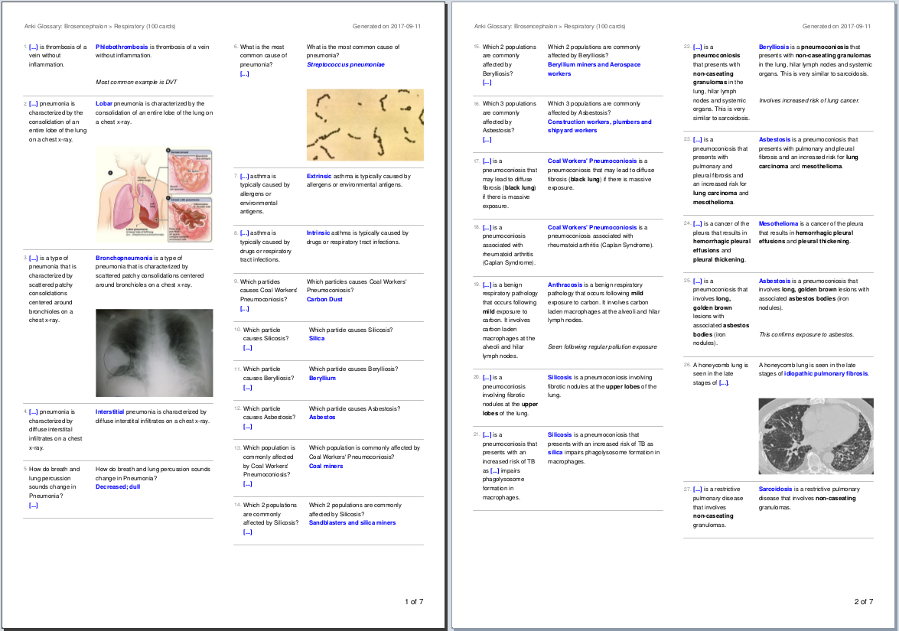
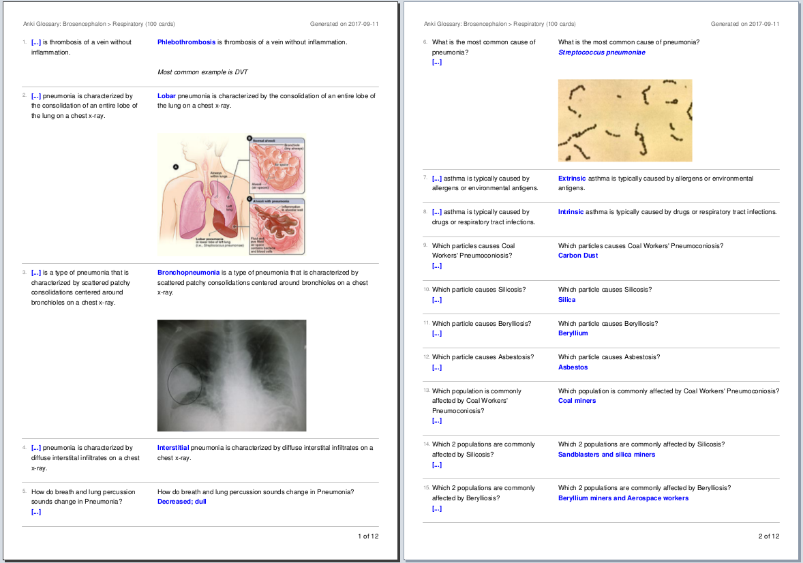

## PDF Glossary Export Add-on for Anki

This is an add-on for the spaced-repetition flashcard app [Anki](https://apps.ankiweb.net/) that allows you export your decks as compact HTML and PDF glossaries.

### Table of Contents

<!-- MarkdownTOC -->

- [Screenshots](#screenshots)
- [Installation](#installation)
- [Documentation](#documentation)
- [License and Credits](#license-and-credits)

<!-- /MarkdownTOC -->

### Screenshots

*Two-column format*

*One-column format*

### Installation

*AnkiWeb*

[Link to the add-on on AnkiWeb]()

*Manual installation*

1. Go to *Tools* -> *Add-ons* -> *Open add-ons folder*
2. Find and delete `PDF Glossary.py` and `pdf_glossary` if they already exist
3. Download and extract the latest add-on release from the [releases tab](https://github.com/Glutanimate/pdf-glossary/releases) (you can use the source code archives)
4. Move `PDF Glossary.py` and `pdf_glossary` into the add-ons folder
5. Restart Anki

### Documentation

For further information on the use of this add-on please check out [the original add-on description](docs/description.md).

### License and Credits

*PDF Glossary* is *Copyright © 2017 [Aristotelis P.](https://glutanimate.com/)*

This add-on was made possible with the kind support of Evan (runninreb23). All credit for the initial idea goes to him.

The deck samples in the screenshots are based on the [Brosencephalon deck](https://www.brosencephalon.com/) and used with the kind permission of Amreet Siddhu.

PDF Glossary makes use of the following open-source libraries:

- [xhtml2pdf](https://github.com/xhtml2pdf/xhtml2pdf) 0.2b1. Copyright (c) 2010-2017 Dirk Holtwick and xhtml2pdf contributors. Licensed under Apache License, Version 2.0.
- [reportlab](http://www.reportlab.com/) 3.4.0. Copyright (c) 2000-2017, ReportLab Inc. Licensed under the BSD license.
- [Pillow](https://python-pillow.org/) 4.2.1. Copyright (c) 2010-2017 Alex Clark and contributors. Licensed under the [PIL Software License](https://github.com/python-pillow/Pillow/blob/master/LICENSE).
- [olefile](https://www.decalage.info/olefile) 0.44. Copyright (c) 2005-2017 Philippe Lagadec. [License](https://olefile.readthedocs.io/en/latest/License.html).
- [PyPDF2](https://github.com/mstamy2/PyPDF2) 1.26.0. Copyright (c) 2006-2008 Mathieu Fenniak, (c) 2007 Ashish Kulkarni, (c) 2014 Steven Witham. Licensed under the BSD 3-clause license
- [html5lib](https://github.com/html5lib/) 0.999999999. Copyright (c) 2006-2013 James Graham and other contributors. Licensed under the MIT license.
- [webencodings](https://github.com/gsnedders/python-webencodings) 0.5.1. Copyright (c) 2012-2017 Geoffrey Sneddon. Licensed under the BSD license.
- [six](https://github.com/benjaminp/six) 1.10.0. Copyright (c) 2010-2015 Benjamin Peterson. Licensed under the MIT license

Major thanks to everyone who has contributed to these projects.

Licensed under the [GNU AGPLv3](https://www.gnu.org/licenses/agpl.html).
